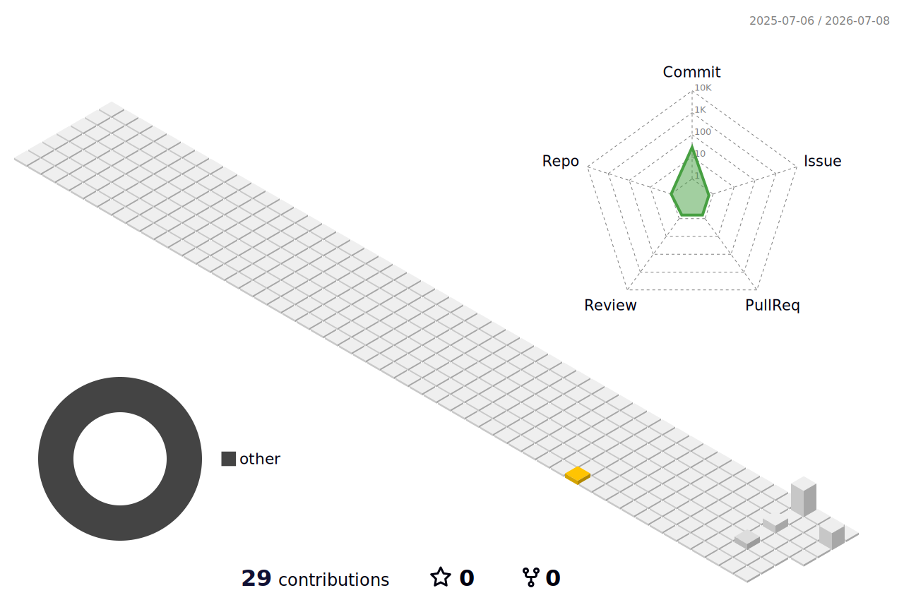

  
  <h1 align="left">Hi 👋, I'm Silen</h1>
  <h3 align="center">Full Stack Developer | Open Source Enthusiast</h3>

 

## About Me
I am a passionate software engineer building scalable web applications.

## Core Tech Stack

### Languages

  
  

### Frontend

  

### Backend

  

### 🌟 Fun Fact: *I can solve a Rubik's cube in under a minute!*

## Socials

  &nbsp;&nbsp;

### View Stats

  
  

  

  
  &nbsp;&nbsp;&nbsp;&nbsp;&nbsp;&nbsp;&nbsp;&nbsp;&nbsp;&nbsp;&nbsp;&nbsp;&nbsp;&nbsp;&nbsp;&nbsp;&nbsp;&nbsp;&nbsp;&nbsp;&nbsp;&nbsp;&nbsp;&nbsp;&nbsp;&nbsp;&nbsp;&nbsp;&nbsp;&nbsp;&nbsp;&nbsp;&nbsp;&nbsp;&nbsp;&nbsp;&nbsp;&nbsp;&nbsp;&nbsp;&nbsp;&nbsp;&nbsp;&nbsp;&nbsp;&nbsp;&nbsp;&nbsp;&nbsp;&nbsp;&nbsp;&nbsp;&nbsp;&nbsp;&nbsp;&nbsp;&nbsp;&nbsp;

  

  &nbsp;
  

## 3D Contribution Graph

  

## Dev Snake

  

